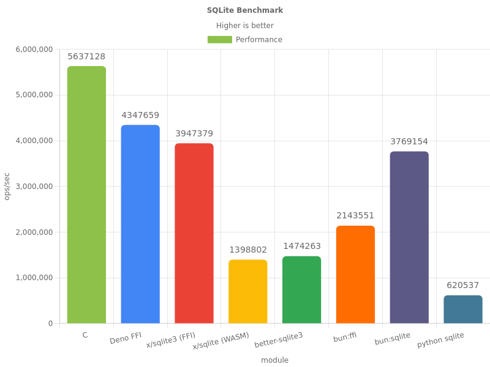

# Deno SQLite3

[](https://github.com/denodrivers/sqlite3/releases)
[](https://doc.deno.land/https/deno.land/x/sqlite3@0.8.0/mod.ts)
[](https://github.com/denodrivers/sqlite3/actions/workflows/ci.yml)
[](https://github.com/denodrivers/sqlite3/blob/master/LICENSE)
[](https://github.com/sponsors/DjDeveloperr)

The fastest and correct module for SQLite3 in Deno.

## Example

```ts
import { Database } from "https://deno.land/x/sqlite3@0.8.0/mod.ts";

const db = new Database("test.db");

const [version] = db.prepare("select sqlite_version()").value<[string]>()!;
console.log(version);

db.close();
```

## Usage

Since this library depends on the unstable FFI API, you must pass `--allow-env`,
`--allow-ffi` and `--unstable` flags. Network and FS permissions are also needed
on macOS and Linux to download and cache prebuilt library. It's recommended to
just use `--allow-all`/`-A` flag since FFI basically gives full access.

```sh
deno run -A --unstable <file>
```

## Benchmark



[Benchmark](./bench) based on
[just-js/02-sqlite](https://just-js.github.io/benchmarks/02-sqlite.html)

See [bench](./bench) for benchmarks source.

## Documentation

See [doc.md](https://github.com/denodrivers/sqlite3/blob/main/doc.md) for
documentation.

Check out the complete API reference
[here](https://doc.deno.land/https://deno.land/x/sqlite3@0.8.0/mod.ts).

## Native Library

It will download and cache a prebuilt shared library from GitHub releases. For
which it will also need net and read/write permission.

If you want to use custom library, then you can set the `DENO_SQLITE_PATH`
environment variable, containing full path to the SQLite3 shared library.

## Contributing

Code is formatted using `deno fmt` and linted using `deno lint`. Please make
sure to run these commands before committing.

On Linux and macOS, you need to build sqlite3 from source. Make sure that you
have the submodule (`git submodule update --init --recursive`).

```sh
mkdir -p build/
# unix
make
# windows
deno task build-sqlite-win
```

When running tests and benchmarks, you need to use the `DENO_SQLITE_PATH` env
variable otherwise it won't use to local compiled shared library.

```sh
DENO_SQLITE_PATH=build/libsqlite3.dylib deno task bench
```

## Related

- [x/sqlite](https://deno.land/x/sqlite), WASM based.

## License

Apache-2.0. Check [LICENSE](./LICENSE) for details.

Copyright © 2023 DjDeveloperr
